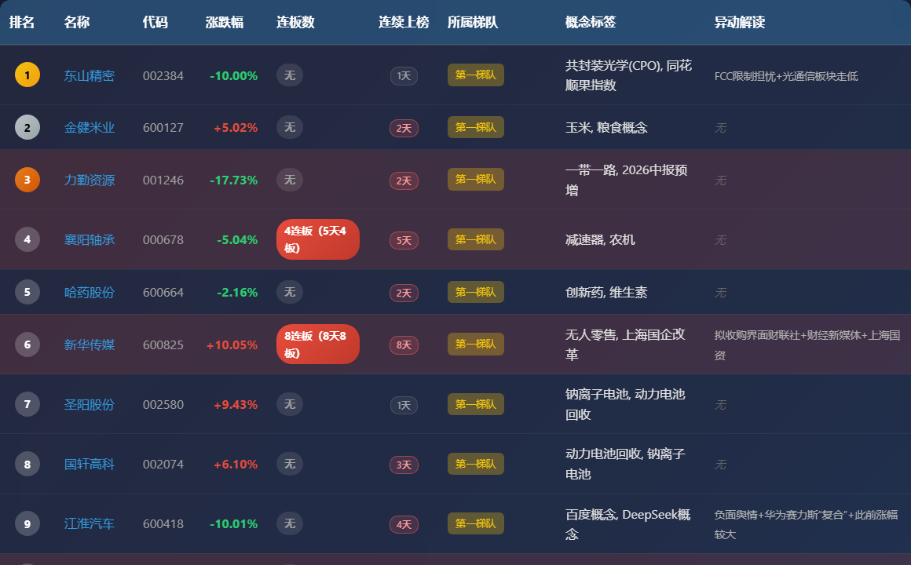
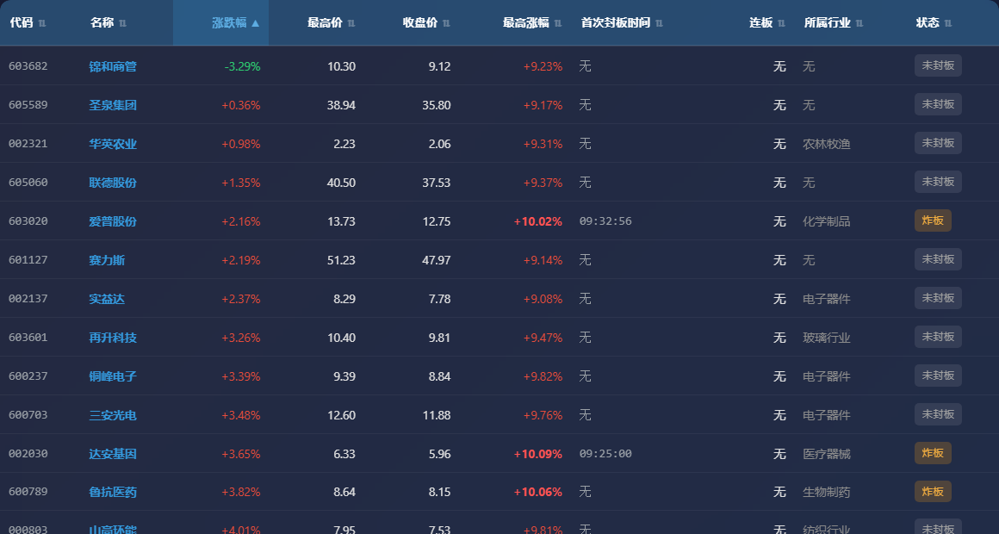
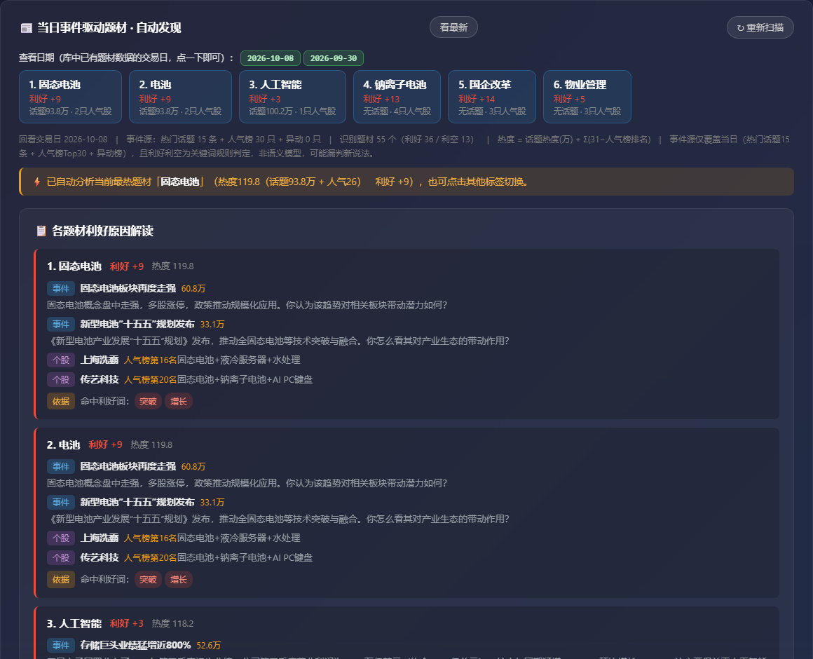
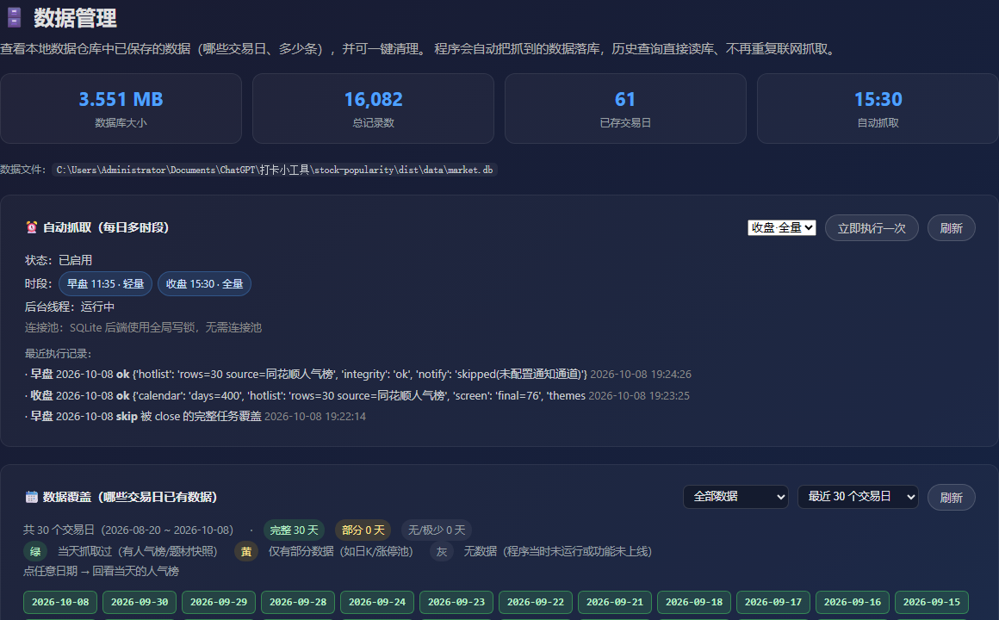
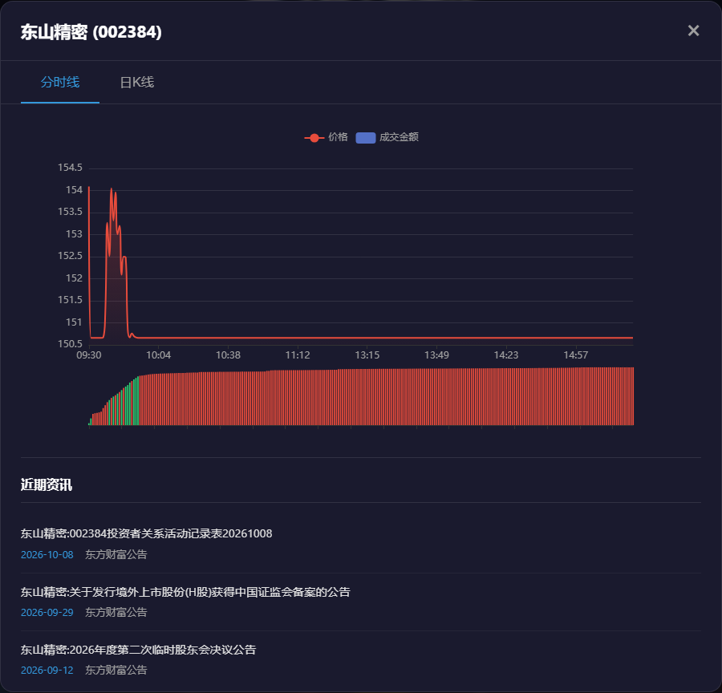

# 📈 A股人气雷达

> **人气榜 · 题材热度 · 首板选股 · 数据复盘** —— 一个免登录、免安装的 A 股市场情绪工作台

[]()
[]()
[]()
[](LICENSE)



---

## 🎯 这是什么

**A股人气雷达** 把短线复盘最常用的四件事串成一条线：

> 从「**谁在被关注**」→ 到「**钱在炒什么题材**」→ 到「**哪只票刚启动**」→ 最后「**落库留痕、随时回看**」

单机运行、免登录、免安装，双击即用，浏览器打开 `http://localhost:5000`。

---

## 🧩 四大功能模块

| 模块 | 解决什么问题 | 核心能力 |
|------|--------------|----------|
| 📊 **人气榜查询** | 今天谁最受关注？ | 同花顺人气 Top30，含涨跌幅 / 连板数 / 连续上榜 / 梯队 / 概念标签 / **上榜原因解读**；支持**按日回看** |
| 🎯 **动态选股** | 哪只票刚启动？ | 输入任意交易日 → 自动推导前一交易日 → 全市场扫描「**昨日未涨停 + 今日盘中冲高 > 9%**」的首板启动股池，出漏斗图 + 明细表 + HTML 报告 |
| 🔥 **题材热度** | 钱在炒什么？ | 自动采集三类当日事件（热门话题 / 人气榜异动解读 / 个股异动原因）→ 归类题材 → 判利好利空 → 按人气输出相关个股 **Top50** |
| 🗄️ **数据管理** | 数据在哪、能不能回看？ | 本地数据仓库：按日查看 / 完整性校验 / 一键清理 / 导出 CSV·Excel / 人气榜历史回补 |
| 📈 **个股详情** | 这只票走势如何？ | 分时线、日K线（按前收盘价算涨幅）、近期资讯与公告 |

---

## 📸 功能预览

### 📊 人气榜查询 —— 一眼看清人气梯队


### 🎯 动态选股 —— 首板启动股池




### 🔥 题材热度 —— 利好题材 + 原因解读



### 🗄️ 数据管理 —— 本地仓库可视化



### 📈 个股详情 —— 分时 / 日K / 资讯



---

## 🚀 快速开始

### 方式一：免安装（普通用户，推荐）

1. 下载 `A股人气雷达.exe`（见 Releases 页）
2. 放到任意文件夹，**双击运行**
3. 浏览器自动打开 `http://localhost:5000`

> 无需安装 Python、无需配置；数据落在 exe 同目录的 `data/` 里，可直接拷贝迁移。

### 方式二：源码运行（开发者）

```
git clone https://github.com/ZekeZJvow/TTT1.git
cd TTT1
python -m venv venv
venv\Scripts\activate
pip install -r requirements.txt
python serve.py
```

打开 http://localhost:5000

### 开机自启 / 定时抓取（Windows）

```
powershell -ExecutionPolicy Bypass -File tools\autostart.ps1 install
powershell -ExecutionPolicy Bypass -File tools\autostart.ps1 status
powershell -ExecutionPolicy Bypass -File tools\autostart.ps1 stop
```

默认每个交易日 **11:35（轻量）/ 15:30（全量）** 自动抓取入库。

---

## 📐 数据口径与规则

| 规则 | 说明 |
|------|------|
| 交易日判定 | 周末 / 节假日自动回溯到**最近已完成交易日** |
| 数据来源 | 同花顺、东方财富、腾讯、新浪（**公开接口**） |
| 存储方式 | 按交易日分行存储，**历史数据相互独立、不会被覆盖** |
| 涨跌幅 | (当日收盘 − 前一日收盘) / 前一日收盘；一字板用前收盘计算 |
| 连板数 | N天M板 → 「M连板（N天M板）」；首板涨停 → 「首板（当日）」；无 → 「无」 |
| 连续上榜 | 按交易日历逐日回推，连续进前 30 名才计数 |
| 题材热度 | 话题热度(万) + Σ(31 − 人气榜排名)，只保留**利好**题材 |

---

## 🗂 项目结构

```
TTT1/
├── app_entry.py            # 打包入口（exe）
├── serve.py                # 后台常驻服务入口
├── server.py               # Flask 后端 + 全部 API
├── market_db.py            # 数据层（SQLite / MySQL 双后端）
├── screener.py             # 动态选股引擎
├── event_theme_service.py  # 题材热度引擎
├── theme_heat_service.py   # 指数目录 / 成分股 / CLI 适配
├── scheduler.py            # 定时任务
├── notifier.py             # 邮件 / 企微 / 钉钉 / 微信推送
├── index.html / app.js / styles.css   # 前端（原生 JS + ECharts）
├── schema.sql              # 建表脚本
├── tools/                  # 自启脚本、历史回补、MySQL 迁移
├── tests/                  # 自动化测试
├── docs/                   # 产品 / 接口 / 部署 / 用户手册
├── assets/                 # README 截图
└── 一键上传.bat             # 双击即可提交并推送
```

---

## 🧪 测试

```
python tests/run_tests.py                # 数据层 / 校验 / 清理 / 定时 / 通知
python tests/test_theme_history_e2e.py   # 题材热度按日回看（端到端）
python tests/test_theme_no_overwrite.py  # 题材存档防覆盖
```

---

## ⚠️ 合规与免责

- 数据来自**公开接口**，**仅供个人研究学习**使用；商用分发请自行评估并遵守各数据源服务条款。
- 本软件所有数据与图表**不构成任何投资建议**，据此操作风险自负。
- 题材热度的利好 / 利空为**关键词规则判定**，非语义模型，可能漏判新说法。

---

## 📄 许可

本项目为**商业授权软件**（非开源），版权归作者所有。详见 [LICENSE](LICENSE)。
如需商用授权，请通过仓库 Issues 联系。
